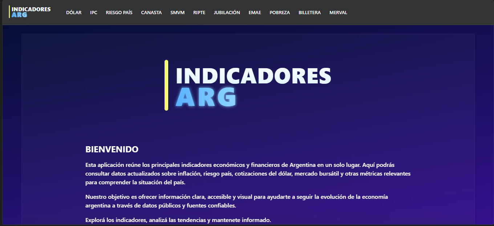
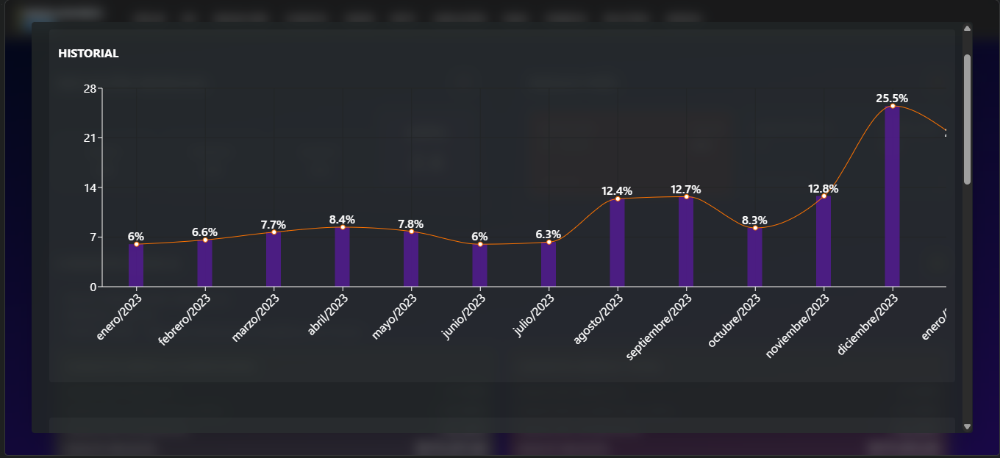
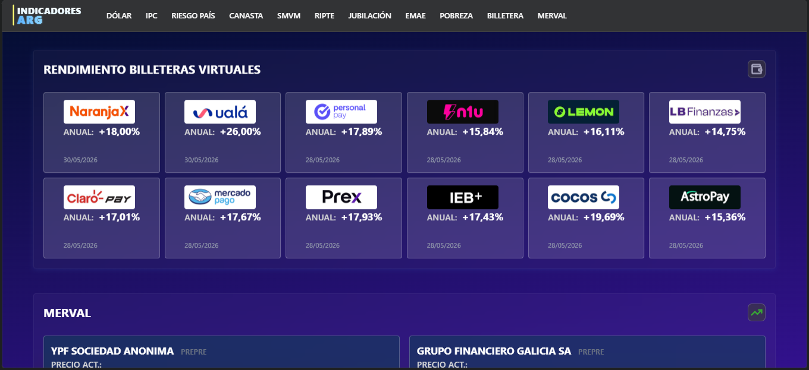
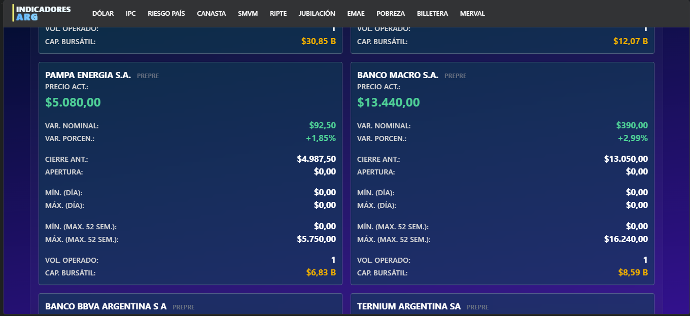

# 🇦🇷 Indicadores Económicos Argentina



Aplicación web desarrollada con React y TypeScript para visualizar distintos indicadores económicos de Argentina en un único lugar.

Este proyecto fue creado con fines educativos y de aprendizaje, con el objetivo de practicar desarrollo frontend, consumo de APIs, visualización de datos y despliegue de aplicaciones web.

## 📸 Capturas

<p align="center">
  
  
</p>

<p align="center">
  
</p>

## 📊 Indicadores disponibles

Actualmente la aplicación muestra información como:

* Cotizaciones del dólar
* Inflación
* Riesgo País
* Canasta Básica
* Salario Mínimo, Vital y Móvil
* RIPTE
* Jubilación mínima
* Índice de pobreza
* Rendimientos de billeteras virtuales
* Índice Merval
* EMAE (Estimador Mensual de Actividad Económica)
* Acciones argentinas

## 🚀 Tecnologías utilizadas

### Frontend

* React
* TypeScript
* Vite
* Tailwind CSS
* TanStack Query
* Recharts
* Framer Motion
* Lucide React

### Backend y despliegue

* Node.js
* Vercel

## 📦 Librerías principales

* @tanstack/react-query
* recharts
* framer-motion
* lucide-react
* cheerio
* clsx
* tailwind-merge
* yahoo-finance2

## 🔗 Fuentes de datos

Los datos son obtenidos desde distintas APIs y fuentes públicas:

* ArgenStats
* Argly
* Yahoo Finance
* API Datos
* Dólar API
* datos.gob.ar
* INDEC

Cada fuente mantiene sus propios tiempos de actualización y disponibilidad.

## ⚠️ Descargo de responsabilidad

La información mostrada tiene fines exclusivamente informativos y educativos.

Este proyecto no constituye asesoramiento financiero, económico ni de inversión. Los datos pueden contener demoras, errores o diferencias respecto de las fuentes oficiales.

## 🛠️ Instalación local

Clonar el repositorio:

```bash
git clone <url-del-repositorio>
```

Ingresar al proyecto:

```bash
cd nombre-del-proyecto
```

Instalar dependencias:

```bash
npm install
```

Iniciar el entorno de desarrollo:

```bash
npm run dev
```

## 🎯 Objetivos del proyecto

Este proyecto fue realizado para practicar:

* Arquitectura de aplicaciones React
* TypeScript
* Consumo de APIs
* Manejo de estado asíncrono con React Query
* Visualización de datos y gráficos
* Responsive Design
* Despliegue en Vercel

## 🚧 Proyecto en evolución

Este es un proyecto personal que utilizo para practicar desarrollo web.

Seguiré agregando nuevos indicadores, visualizaciones y mejoras técnicas a medida que encuentre nuevas ideas o aprenda mejores formas de implementarlas.

## 📄 Licencia

Proyecto personal desarrollado con fines educativos.
